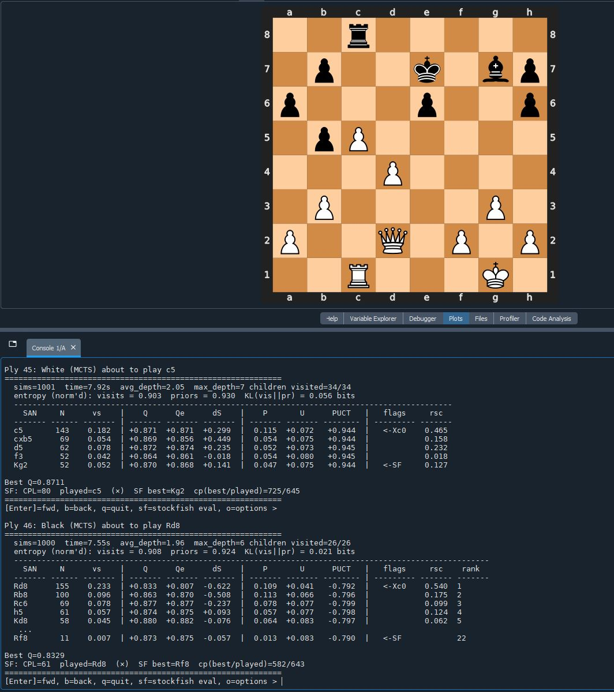
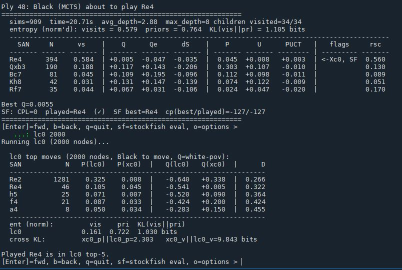
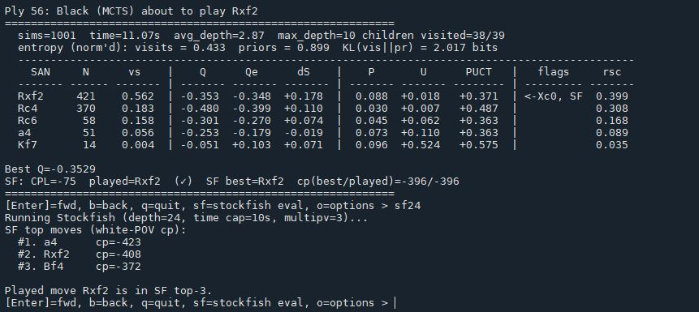

# Review Tools

Every game is serialized to a pickle containing the full move history, per-ply search stats, NN outputs, and Stockfish analysis results. The review tools load these pickles for post-hoc analysis.

## GameViewer

`GameViewer` is the primary analysis tool. It loads a game pickle and provides a per-ply breakdown of everything that happened during search.

For each move, the view shows:

- **Visit counts** — how many simulations visited each candidate move.
- **Policy prior vs search distribution** — the raw NN prior alongside the final visit share, making it easy to see where search agreed with or diverged from the network's initial guess.
- **Q and Qema** — mean action value and its exponential moving average, both surfaced per candidate.
- **PUCT contributions** — the Q and U components broken out, so you can see whether a move was selected for its value or because it was underexplored.
- **Entropy and KL divergence** — visit distribution entropy and KL from the prior, measuring how much the search reshaped the policy over the course of the simulation budget.
- **Stockfish comparison** — the SF best move and centipawn evaluation from post-hoc analysis, shown alongside the Xerces move for each ply.

`seek_cpl(threshold)` jumps to the next ply where centipawn loss exceeds a threshold, making it fast to navigate to the most instructive moments in a game.

## LC0 Comparison

`GameViewer` can run Leela Chess Zero on any position and overlay its policy distribution alongside Xerces. This surfaces distribution differences and KL divergence between the two engines' policies — useful for examining how Xerces weights moves relative to a well-established reference engine, and for spotting systematic gaps in opening knowledge or positional understanding.

## Deeper Stockfish Evaluation

The rescoring pipeline runs Stockfish at a fixed depth for training data generation. During review, any position can be re-evaluated to an arbitrary depth directly from `GameViewer`. This is useful when the standard rescoring depth was shallow on a particular position and you want a stronger ground-truth evaluation to assess whether the engine's play was sound.

## RecordKeeper

`RecordKeeper` aggregates game outcomes and performance metrics across the worker pool. It tracks W/D/L totals, total simulations used, active game counts, and throughput — moves per second, leafs per second, batch fill rate, and cache hit rate. These metrics feed the live telemetry display during a run and are also logged to the progress CSV for offline analysis.
