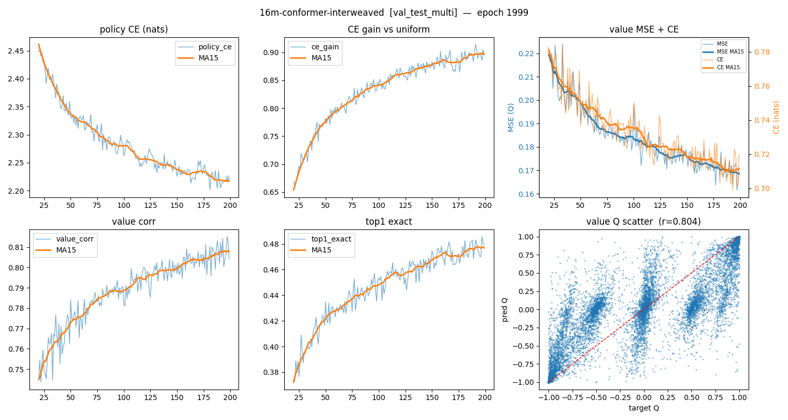
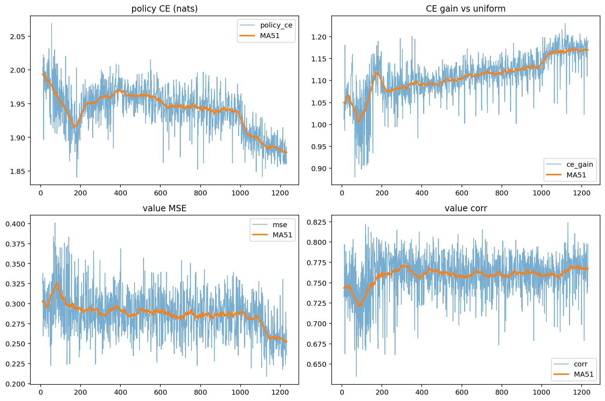
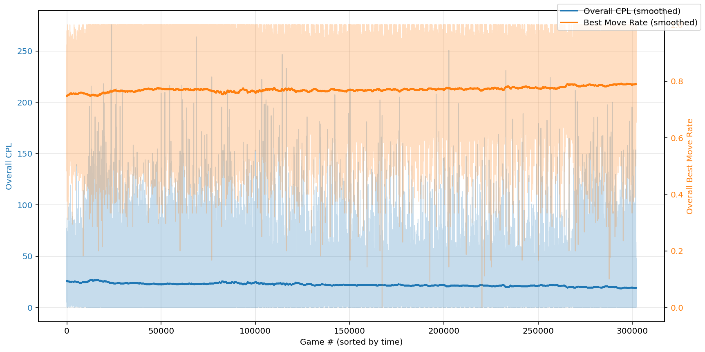

# How Does it Work?

Xerces is a neural-network-guided MCTS chess engine. Like AlphaZero and Leela Chess Zero, it works by having a model supply priors over legal moves, then using search to test those beliefs against actual continuations.

The short version is:

1. The model looks at a chess position.
2. It predicts which moves look promising and who is likely winning.
3. MCTS uses those predictions to build a search tree.
4. The search repeatedly explores, expands, evaluates, and backs up results.
5. The engine plays the move that survives the most search pressure.
6. The resulting search data becomes training data for the next model.

## MCTS 101

Monte Carlo Tree Search is a way to make decisions by building a tree of possible
future positions. Each node in the tree is a board position. Each edge is a legal
move. The root is the current position.

For each simulation, MCTS does four things:

1. **Select** a path through the existing tree.
2. **Expand** a new position that has not been searched yet.
3. **Evaluate** that position with the neural network.
4. **Back up** the result through every node on the selected path.

```text
          ROOT
         /    \
        A      B          1. SELECT: follow best PUCT scores
       / \      \
      A1  A2     B1  <--- expand & evaluate this new node
      
  backup: +0.6 flows up through B -> B1 path
```

Over many simulations, good moves tend to collect more visits. Bad moves may
still be checked, but they receive less attention unless there is a reason to
look again.

This is different from a traditional alpha-beta engine like Stockfish. Stockfish
uses a shallow NN evaluation and extremely fast but relatively unguided tactical search.
Xerces instead uses a neural network evaluation and a search process that behaves more like
progressive evidence gathering.

## What the Neural Network Predicts

The model produces two outputs.

The first is **policy**. Policy is a probability distribution over moves. It tells
MCTS which moves look promising before the search has spent much time
on them.

The second is **value**. Value is the model's estimate of the position. Xerces uses
a win/draw/loss head — rather than a single scalar, the model returns three
probabilities from the side-to-move perspective that sum to 1.

So when the model evaluates a position, it returns something like:

```text
policy: e4 28%, d4 22%, Nf3 12%, c4 10%, ...
value:  W 45%  D 38%  L 17%
```

The model gives the search a starting point. Those values are then tested by repeatedly running the expand, evaluate, and back up loop.

## How PUCT Guides the Search

[PUCT](https://www.nature.com/articles/nature16961) is the selection formula used by AlphaZero-style MCTS engines. It balances
two competing forces:

- **Exploitation:** search moves that already look good.
- **Exploration:** search moves that the model thinks may be promising, even if
  they have not been visited much yet.

Each candidate move receives a score made from two pieces:

```text
PUCT score = Q + U
```

`Q` is the current average value of the move based on previous search results.
If a move keeps leading to good evaluations, its `Q` rises. If it keeps leading
to bad positions, its `Q` falls.

`U` is the exploration bonus. It is larger for moves with strong policy priors
and fewer visits. This is how the neural network gets injected into the search.
A move with a high prior gets early attention, but that bonus shrinks as the move
is visited more.

The search repeatedly chooses the move with the highest `Q + U` score. Early in
the search, policy matters a lot. Later in the search, accumulated evidence
matters more.

## One Simulation Step

A single Xerces simulation looks roughly like this:

```text
start at root
while current node is already expanded:
    choose child with best PUCT score
    move to that child

evaluate the new leaf position with the neural network
create child nodes using the policy output
back up the value through the selected path
```

During backup, the evaluated value updates visit counts and average values along
the path. Because chess alternates sides, the value is flipped as it moves from
one player's perspective to the other.

After thousands of simulations, the root node contains a visit distribution over
legal moves. The most-visited move is usually the move Xerces plays.

## Why Visits Matter

The visit count is important because it represents search confidence. A move can
look good after one evaluation and still collapse after deeper exploration. A
move that attracts thousands of visits has survived more pressure.

This is also why MCTS produces useful training targets. The model does not only
learn from the final game result. It learns from the search distribution itself.
If MCTS spends most of its time on one move, the next model is trained to assign
that move a higher prior in similar positions.

That creates the core improvement loop:

```text
better model -> better search -> better training targets -> better model
```

## Pretraining

Before self-play begins, the model is pretrained on static data. This gives it basic chess structure before it has to generate its own training data.

Pretraining can include positions analyzed by Stockfish, existing game data, or
other supervised targets. The goal is not to make a perfect engine immediately.
The goal is to reduce the amount of self-play training required.

A randomly initialized model gives weak priors and noisy values. Search can still
run, but it wastes a lot of effort. A pretrained model gives the search better
first guesses, which makes self-play refinement much more efficient.



## Self-Play Refinement

After pretraining, Xerces improves through self-play.

In self-play, Xerces plays games against itself. For every move, it stores the
position, the final search visit distribution, and eventually the game result.
Those records become training examples.

A simplified training row looks like this:

```text
position: board state before the move
policy target: MCTS visit distribution
value target: game outcome or refined value target
```

The policy target teaches the model to imitate the search. The value target
teaches the model which positions are actually converting into wins, losses, or
draws.

After enough games are collected, the model is retrained. Then the updated model
plays more self-play games, generating a stronger batch of data. The cycle
repeats.





## Training Mode vs Competition Mode

Xerces behaves differently depending on whether it is generating training data or
trying to play the strongest possible move.

### Training Mode

In training mode, the goal is not only to win the current game. The goal is to
produce useful data.

Training mode may use more randomness, exploration, sampling, or noise. This
helps the engine see a wider range of positions instead of repeating the same
lines forever.

The engine records search distributions, results, metadata, and later rescoring
information. These outputs are more important than a single game's result,
because they feed the next training cycle.

Training mode is designed to be curious.

### Competition Mode

In competition mode, the goal is simple: play the strongest move available.

Competition mode reduces randomness and uses the search result more directly.
The engine usually chooses the most robust move from the root search, often the
move with the strongest visit count or best final selection score.

Exploration still exists inside the search through PUCT, but the final move
choice is much more deterministic. The engine is no longer trying to create broad
training data. It is trying to convert the current position.

Competition mode is designed to be ruthless.
