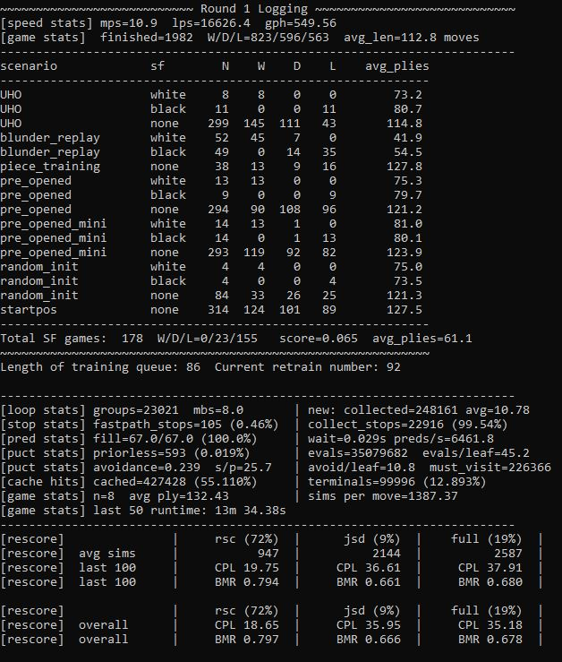
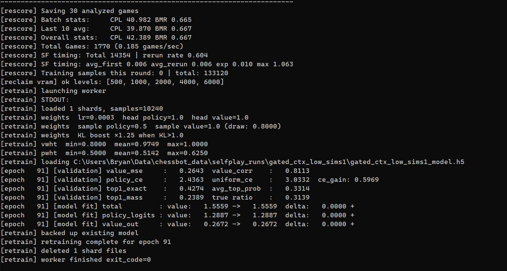

# Selfplay Tools

## Selfplay Telemetry

Live stats during self-play: moves/sec, leaf evals/sec, games/hour, cache hit rate, PUCT stats, per-scenario results.

---

## Retrain Loop

Retraining runs as a subprocess between self-play rounds. Tracks value MSE, value correlation, policy cross-entropy, top-1 accuracy, and CE gain vs uniform.

---

## MCTS Move Analysis

Post-hoc analysis via `GameViewer`. Per-move breakdown: visit counts, policy prior vs search distribution, Q/Qe values, PUCT contributions, entropy, KL divergence, and Stockfish comparison.

---

## Lc0 Comparison

Compare Xerces policy outputs against Leela Chess Zero to examine distribution differences and KL divergence.

---

## Deeper Stockfish Evaluation

Re-run Stockfish on any position during game review to search to an arbitrary depth.
